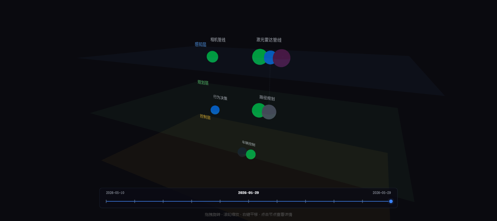

# Topos MCP

面向 AI Agent 驱动开发的项目智能追踪工具。追踪哪些功能被提出、哪些已实现、哪些已作废、以及 Agent 下一步计划做什么。



## 安装

### npm（推荐）

```bash
npx @topos/mcp init    # 在当前项目初始化
npx @topos/mcp serve   # 启动 MCP server + Dashboard
```

### 从源码安装（GitHub）

```bash
git clone https://github.com/timgunnar/topos-mcp.git
cd topos-mcp
npm install
npm run build
node packages/mcp-server/dist/index.js init    # 在当前项目初始化
node packages/mcp-server/dist/index.js serve   # 启动 MCP server + Dashboard
```

打开 `http://localhost:4321` 查看 3D 拓扑图。

## Claude Code 配置

```json
{
  "mcpServers": {
    "topos": {
      "command": "npx",
      "args": ["@topos/mcp", "serve"]
    }
  }
}
```

注入 Agent 工作习惯：

```bash
npx @topos/mcp skill
```

## 工作原理

Topos MCP 在 `.devion/` 目录维护一个 `project.yaml` 文件，追踪项目的架构（分层 → 模块 → 功能点）、实现状态和 Agent 计划。3D Dashboard 将其可视化为可交互的拓扑图。Agent 启动时读取 `agent-context.md`，工作中通过 MCP 工具更新状态。

## Dashboard 操作

- **拖拽** — 旋转
- **滚轮** — 缩放
- **右键拖拽** — 平移
- **点击节点** — 查看功能详情
- **时间轴滑块** — 回看项目历史

## License

MIT
