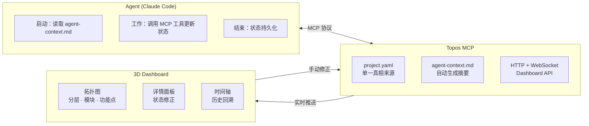
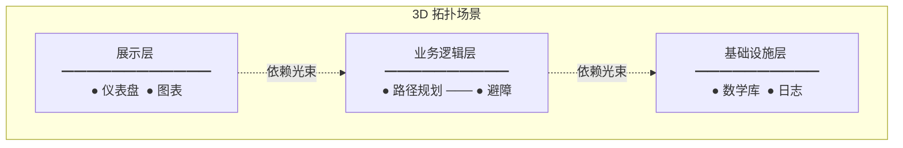
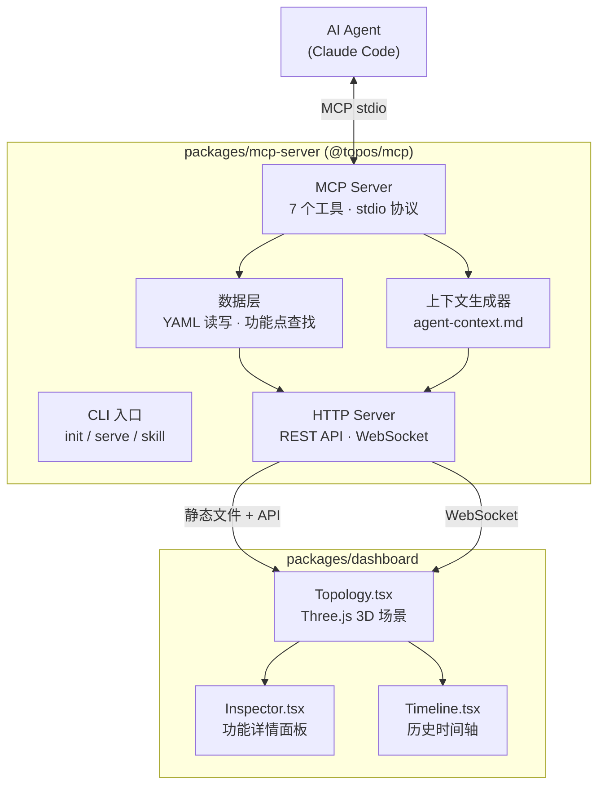

# Topos MCP

**给 AI Agent 装上项目记忆。追踪什么被提出、什么已实现、什么已作废、下一步做什么——然后渲染成 3D 拓扑图。**

不改工作流、不换工具。Agent 通过 MCP 工具更新状态，人通过 Dashboard 一眼看清全局。



---

## 仪表盘预览

> 打开 `http://localhost:4321`，你将看到：



| 视觉效果 | 含义 |
|---------|------|
| 🟢 绿色常亮 | 已实现 |
| 🔵 蓝色脉冲 + 进度环 | 实现中 |
| ⚪ 灰色暗淡 | 已作废 |
| 🔴 红色警报脉冲 | BUG 修复 |
| ✨ 高亮光环 | Agent 当前工作节点 |

**操作方式：拖拽旋转 · 滚轮缩放 · 右键平移 · 点击节点查看详情 · 时间轴滑块回看历史**

---

## 快速开始

### npm（推荐）

```bash
npx @topos/mcp init    # 在当前项目初始化
npx @topos/mcp serve   # 启动 Dashboard (端口 4321) + MCP Server
```

### 从源码安装

```bash
git clone https://github.com/timgunnar/topos-mcp.git
cd topos-mcp
npm install && npm run build
node packages/mcp-server/dist/index.js init
node packages/mcp-server/dist/index.js serve
```

---

## 架构



### 数据模型

```
项目
├── 分层 (Layer)        — 架构层级，如感知层、规划层
│   └── 模块 (Module)    — 功能分组
│       └── 功能点 (Feature) — 单个需求
│           ├── 状态: active / in_progress / implemented / deprecated
│           ├── 来源: feature_request / bug_fix / refactor / optimization
│           ├── 优先级: low / medium / high / critical
│           ├── 依赖: 关联其他功能点
│           └── 历史: 完整演化记录
└── 计划 (Plan): current / next / recently_deprecated
```

---

## 7 个 MCP 工具

| 工具 | Agent 调用时机 | 效果 |
|------|---------------|------|
| `topos_add_feature` | 人提出新功能需求 | 创建功能点 + 记录来源 |
| `topos_mark_progress` | 取得部分进展 | 更新进度百分比 (0-100) |
| `topos_mark_done` | 功能完全实现 | 标记已实现 + 从计划移除 |
| `topos_mark_deprecated` | 人决定取消功能 | 标记作废 + Agent 停止开发 |
| `topos_get_status` | 需要查看某个功能 | 返回完整状态 + 层级信息 |
| `topos_get_plan` | 需要知道下一步 | 返回当前计划 + 下一步 |
| `topos_list_features` | 需要浏览功能列表 | 按层/模块/状态筛选 |

## Claude Code 配置

```json
{
  "mcpServers": {
    "topos": {
      "command": "npx",
      "args": ["@topos/mcp", "serve"]
    }
  }
}
```

注入 Agent 工作习惯（可选）：

```bash
npx @topos/mcp skill
```

Agent 启动时自动读取 `.devion/agent-context.md`，工作中按需调用 MCP 工具更新状态。

---

## 核心价值

| 价值 | 说明 |
|------|------|
| **Agent 不遗忘** | 跨会话持久化项目状态。Agent 启动时读取摘要，知道已完成什么、正在做什么、什么已作废 |
| **人类可审查** | 3D Dashboard 一眼看清全局。发现偏差直接通过 UI 手动修正，project.yaml 即时更新 |
| **零侵入** | 不改变现有工作流。Agent 通过标准 MCP 协议通信，Dashboard 通过 HTTP 读取。卸载：删除 `.devion/` 目录即可 |
| **单一真相来源** | 一个 `project.yaml` 文件，既是 Agent 的数据源，也是 Dashboard 的渲染源，也是人类的修正入口 |

---

## 卸载

```bash
rm -rf .devion/                    # 删除项目数据
# 如果安装了 CLI
npm uninstall -g @topos/mcp
```

## License

MIT
